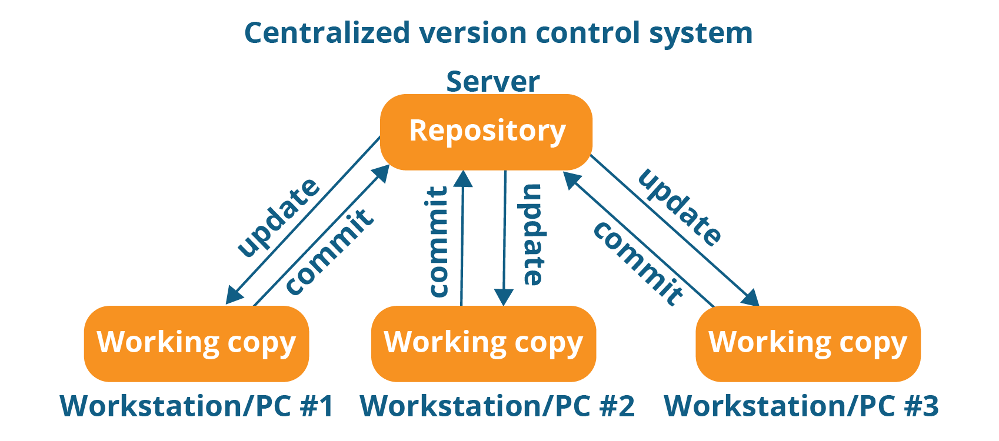
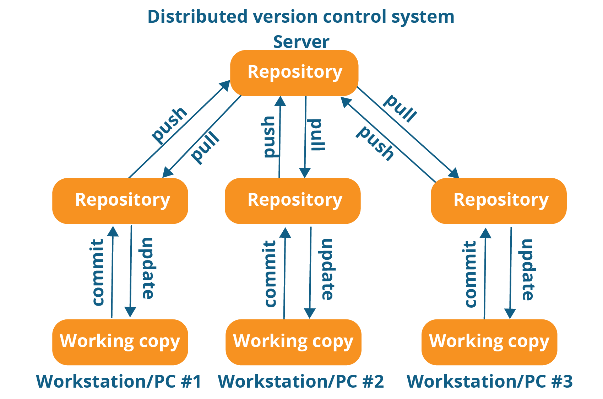
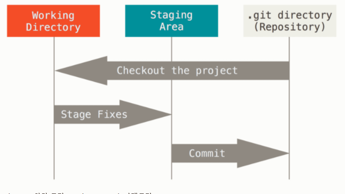
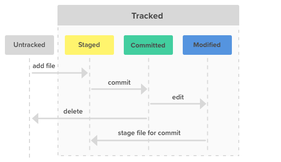

# Git이란?

### 🗒️참조

[[토크ON세미나] Git & GitHub Page 블로그 만들기 1강 - Git 기초 | T아카데미](https://www.youtube.com/watch?v=YQat_D1C-ps)

[Git - Git 기초](https://git-scm.com/book/ko/v2/%EC%8B%9C%EC%9E%91%ED%95%98%EA%B8%B0-Git-%EA%B8%B0%EC%B4%88)

---

# 📌 학습목표

- **VCS, CVCS, DVCS란?**
- **Git workflow**

---

## 🌟 VCS, CVCS, DVCS

### **VCS(Version Control System)**

⇒ 파일(txt, img, file...)의 변경 사항을 저장하고, 원하는 시점의 버전을 다시 꺼내올 수 있는 시스템

- **Snapshot** : 특정 시점에서 파일의 상태 (현재 상태의 모든 정보)
- **Delta** : 파일의 이전 상태와 비교한 변경사항

### CVCS(**Centralized Version Control)**

- 즉각적으로 동기화가 이루어짐 → 최신 서버만 업데이트가 된다.
- 중앙서버가 무조건 있어야 한다.
- 그러나 서버에 문제가 발생하게 되면 이용하지 못함

### DVCS(**Distributed Version Control)**

- git, mercurial, darcs
- Repository의 파일 시스템 전체를 snapshot으로 취급. 변경하지 않은 파일은 새로 저장하지 않고 링크만 저장
- server 뿐만 아니라 개발자들도 history를 가진다.
- server에 문제가 생겨도 개발자들이 가진 history를 통해 server 복원이 가능하다.

---

## 🌟 Git workflow

### git의 흐름

1. **Git 사용 선언**
    - 선언과 저장소 (**Init**ilization & Repository)
        - 흔히 Repo(레포)라고 부른다.
        - 사용자가 변경한 모든 내용을 추적하는 공간 (하나의 **디렉토리**로 볼수 있다.)
        - 현재 상태, 변경 시점, 변경한 사용자, 설명 텍스트 등 저장
    - Git은 이제 Local에서 가능한 상태
        - 모든 것은 local에서 저장 및 버전 관리 기능 (서버 죽어도 무상관)
        - 원격 서버(GitHub)에서는 나중에 올릴 수 있음
    - Git은 데이터를 추가만 할 수 있다.
        - 파일 삭제 == 삭제 기록 추가 ⇒ -1 == +(-1)
        - 데이터베이스에 저장한 순간부터는 삭제까지 추적
    - Git은 파일을 추적하지 않는다.
        - 대신, 파일의 내용 단위로 추적하고, 각 문자와 줄을 추적한다.
        - 빈 디렉토리는 추적하지 않는다.
2. **파일 상태**
    - 어떤 파일이 상태에 따라 계속 바뀌고, 딱히 저장할 필요가 없다면? 저장하지 말고, 굳이 관리하고 싶지 않은 파일은 따로 처리하자.
        - Untracked, Tracked
    - Git이 추적하는 파일은 총 3가지 상태로 구분
        - Committed란 데이터가 로컬 데이터베이스에 안전하게 저장됐다는 것을 의미한다.
        - Modified는 수정한 파일을 아직 로컬 데이터베이스에 커밋하지 않은 것을 말한다.
        - Staged란 현재 수정한 파일을 곧 커밋할 것이라고 표시한 상태를 의미한다.

        ⇒ 이 세 가지 상태는 Git 프로젝트의 세 가지 단계와 연결돼 있다.

        

    - **Git directory(repository)** : git이 프로젝트를 저장하는 곳. 다른 컴퓨터에 있는 저장소를 `clone` 할 때 git 디렉토리가 생성된다.

        → Staging area에 파일들을 커밋해서 git 디렉토리에 영구적인 스냅샷으로 저장한다.

    - **워킹트리(working directory)** : 프로젝트의 특정 버전을 `checkout`한 것이다. git 디렉토리는 지금 작업하는 것이고 그 디렉토리 안에 압축된 db에서 파일을 가져와 워킹 트리를 만든다.

        → 파일을 수정하는 공간이라 생각하면 된다.

    - Staging area : git 디렉토리에 있다. 단순한 파일이고 곧 커밋할 파일에 대한 정보를 저장한다.

        → stage해서 커밋할 스냅샷을 만든다. 모든 파일 추가 및 일부 파일만 추가 할 수 있다.

3. **변경 사항 선택**
    - Staging을 하면 커밋하고 싶은 파일 선택, Commit을 하면 새로운 버전으로 업로드
        - 근데 Staging은 업로드를 2번하는 과정으로 보이는데 왜 굳이 한 번 더 과정을 거치는 걸까???

            
            
            -> 위 그림은 파일의 라이프 사이클이다. 이런 라이프사이클이 계속 반복된다. 아주 중요한 그림이니 숙지하자!!!

        - 왜 두가지를 거칠까?

            → 여러 작업 중, 일부분만 커밋해야할 때이다. 즉, 필요한 부분만 업로드하고 싶을 경우를 고려해서이다.

            → 커밋 전 상태를 수정 또는 체크하여 더블체킹이 가능하다.

    **4.  커밋 완료**

    - 커밋을 하면 이상한 40자리 숫자 + 알파벳 조합이 생긴다?
        - 상태를 찾기 위해서는 Key가 필요, 버전의 주소
        - 내용(파일 구조)등을 Hash값으로 만들고 상태를 나타낸다.
        - 여기서는 SHA1 해시 값을 사용하여 40자리로 표현
        - Commit Hash 값으로 Checkout하면 버전 이동까지 완료!!!

        SHA(Secure Hash Algorithm, 안전한 해시 알고리즘) 함수들은 서로 관련된 암호학적 해시 함수들의 모음이다. 최대 2^64bit의 메시지로부터 160bit의 해시 값을 생성하는 일방향 해쉬함수이다. -위키백과-
